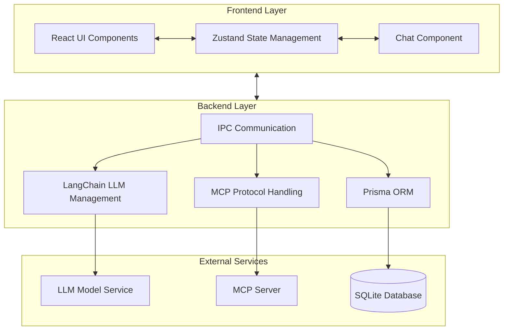

# Forge - AI 助手桌面应用

Forge 是一个跨平台的桌面 AI 助手应用，支持多种 AI 模型、对话管理和丰富的格式化功能。

## 功能特点

### 多模型支持

- 集成主流 AI 模型，包括 OpenAI、Gemini、Anthropic、DeepSeek 等
- 自定义服务提供商和模型配置

### AI 助手与对话管理

- 通过系统提示词创建自定义助手
- 可调节的模型参数（温度、top-p）
- 自动对话命名和历史记录管理

### 对话格式化

- 文本和 Markdown 支持
- 代码语法高亮
- Mermaid 图表可视化
- 数学公式渲染

### 用户体验

- 跨平台兼容性（Windows、macOS、Linux）
- 明/暗主题支持
- 全局搜索功能
- 对话管理（删除、重命名等）
- 拖放式对话组织

### 隐私与安全

- 本地数据存储，增强隐私保护
- MCP（模型上下文协议）支持，用于访问外部工具和数据源

## 技术栈

- **Electron**: 跨平台桌面框架
- **React**: 前端框架
- **Zustand**: 状态管理
- **Tailwind CSS**: 实用优先的 CSS 框架
- **Radix-UI**: UI 组件库
- **LangChain**: 带流式传输支持的 LLM API 请求库
- **Prisma**: 现代化 ORM 数据库交互工具

## 架构

Forge 采用 Electron 构建，使用主进程/渲染进程架构，结合 React 前端和 Node.js 后端：

### 前端

- Electron 渲染器进程处理前端逻辑
- React 组件结构管理用户界面
- Zustand 管理应用状态
- Radix-UI + Tailwind CSS 构建 UI 界面

### 后端

- Electron 主进程管理数据库和 API 调用
- LangChain 处理 AI 模型调用
- MCP TypeScript SDK 实现 MCP Client
- Prisma ORM 处理数据模型和数据库操作
- SQLite 数据库存储用户数据、对话历史和设置

## 目录结构

```
forge/
├── src/
│   ├── main/                 # Electron 主进程
│   │   ├── api/             # API 处理程序
│   │   │   ├── index.ts     # API 路由集中管理
│   │   │   ├── llm.ts       # LLM 相关 API
│   │   │   └── mcp.ts       # MCP 协议相关 API
│   │   ├── database.ts      # 数据库初始化和管理
│   │   ├── initialState.ts  # 默认数据和设置
│   │   ├── prisma.ts        # Prisma 客户端管理
│   │   └── main.ts         # 主进程入口
│   │
│   ├── renderer/            # Electron 渲染进程
│   │   ├── src/
│   │   │   ├── components/  # React 组件
│   │   │   ├── store/       # Zustand 状态管理
│   │   │   ├── locales/     # 国际化资源
│   │   │   ├── styles/      # 全局样式
│   │   │   ├── App.tsx      # 应用主组件
│   │   │   └── main.tsx     # 渲染进程入口
│   │   └── index.html       # 主页面
│   │
│   └── preload/             # 预加载脚本
│       ├── preload.ts       # IPC 通信桥接
│       └── index.ts         # 预加载入口
│
├── prisma/                  # Prisma ORM
│   ├── schema.prisma        # 数据库模型定义
│   └── migrations/          # 数据库迁移文件
│
├── public/                  # 静态资源
│
├── electron-vite.config.ts  # electron-vite 配置
├── vite.config.ts          # Vite 配置
├── postcss.config.js       # PostCSS 配置
├── eslint.config.js        # ESLint 配置
├── prettier.config.js      # Prettier 配置
├── tailwind.config.js      # Tailwind CSS 配置
├── tsconfig.json           # TypeScript 配置
└── package.json            # 项目依赖和脚本
```

## 核心目录说明

- 主进程 ( src/main/)
  - 负责应用生命周期管理
  - 处理数据库操作
  - 管理 API 调用和 IPC 通信
  - 集成 LLM 和 MCP 功能
- 渲染进程 ( src/renderer/)
  - React 应用主体
  - 用户界面组件
  - 状态管理逻辑
  - 样式和主题定义
- 预加载脚本 ( src/preload/)
  - 提供主进程和渲染进程间的安全通信桥接
  - 暴露 API 给渲染进程
- 数据库 ( prisma/)
  - 数据模型定义
  - 数据库迁移管理
  - 包含以下主要模型：
    - User (用户信息)
    - Chat (对话记录)
    - Setting (应用设置)
    - Provider (AI 服务提供商)
    - Model (AI 模型配置)

## 架构图



## 开发

### 数据库管理

Forge 使用 Prisma ORM 和 SQLite 数据库进行数据存储。以下是一些常用的数据库管理命令：

```bash
# 生成 Prisma 客户端
npm run prisma:generate

# 创建数据库迁移
npm run prisma:migrate

# 打开 Prisma Studio 可视化数据库管理工具
npm run prisma:studio
```

### 环境设置

```bash
# 安装依赖
npm install

# 生成 Prisma 客户端
npm run prisma:generate

# 启动开发服务器
npm run dev
```

### 构建应用

```bash
# 生成 Prisma 客户端（如果尚未生成）
npm run prisma:generate

# 构建应用
npm run build

# 启动构建后的应用
npm start
```

## 许可证

MIT
